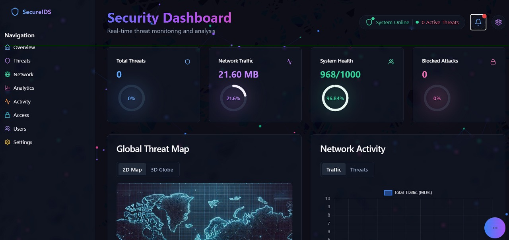
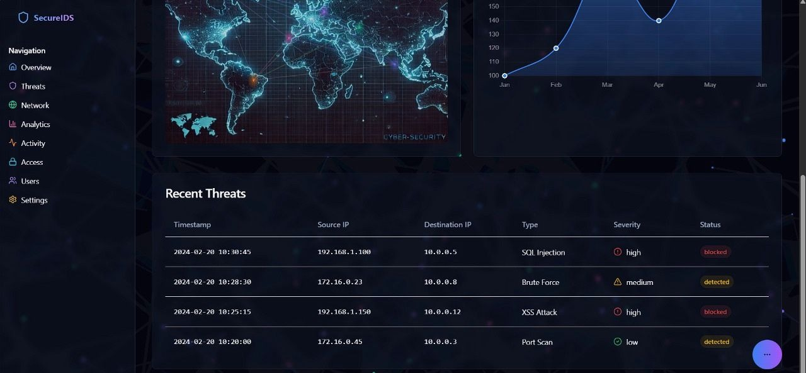
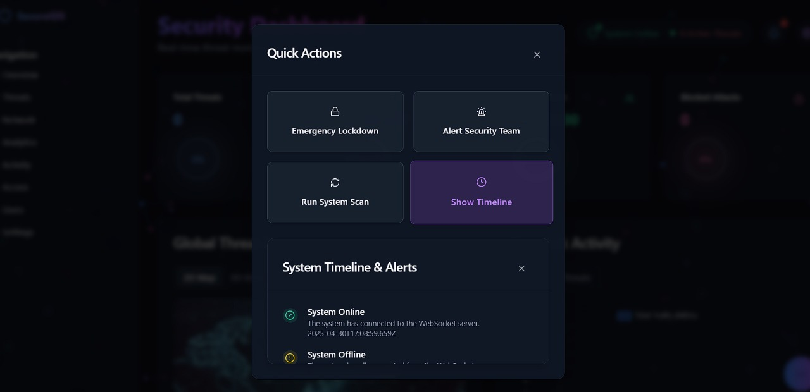
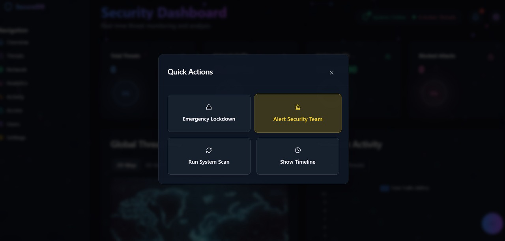
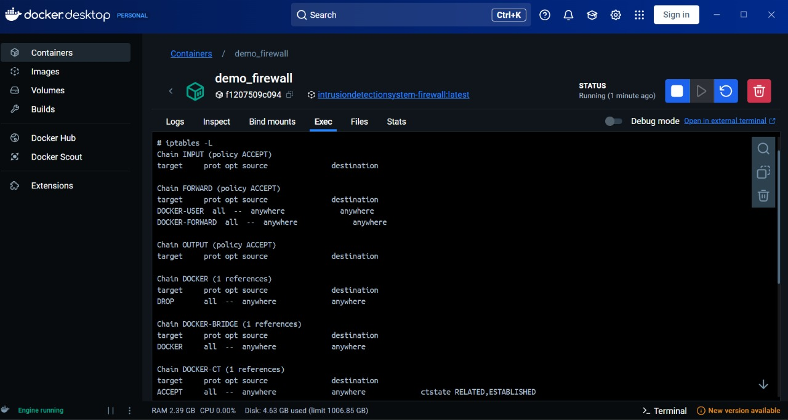

# SentinelAI-Real-Time-IDS-IPS

A full-stack, real-time **Intrusion Detection and Prevention System (IDS/IPS)** that leverages **AI/ML** to monitor live network traffic, detect cyber attacks, and **automatically block malicious IPs** using **Docker-controlled firewall rules**.

---

##  Overview

SentinelAI-Real-Time-IDS-IPS is designed to demonstrate how modern **Security Operations Centers (SOC)** detect, analyze, and respond to cyber threats in real time.

The system captures live network packets, applies machine learning for threat classification, visualizes attacks on an interactive dashboard, and enforces **automatic prevention** by dynamically updating firewall rules inside an isolated Docker environment.

---

##  Key Features

- Real-time network traffic monitoring  
- AI/ML-based intrusion detection  
- Automatic intrusion prevention (IPS)  
- Docker-based firewall isolation  
- Live SOC-style security dashboard  
- Threat severity classification  
- Manual & automated response actions  
- Scalable microservice architecture  

---

##  System Architecture

```

Network Traffic
↓
Packet Sniffing (Scapy)
↓
Feature Extraction
↓
ML Classifier (XGBoost)
↓
Threat Decision Engine
↓
┌──────────────────┐
│ Live Dashboard   │ ← WebSockets (Real-Time)
└──────────────────┘
↓
Docker Firewall (iptables)
↓
Automatic IP Blocking

````

---

##  Technology Stack

### Frontend
- React.js  
- Tailwind CSS  
- WebSockets  

### Backend
- FastAPI (Python)  
- Scapy (Packet Sniffing)  
- asyncio  

### Machine Learning
- XGBoost  
- SMOTE (Class Balancing)  
- SHAP (Model Explainability)

### Security & DevOps
- Docker  
- iptables  
- docker-compose  

---

##  Screenshots

###  Security Dashboard Overview


---

###  Recent Threats Monitoring


---

###  Quick Actions Panel


---

###  Alert & Security Response


---

###  Docker Firewall Enforcement (iptables)


---

##  Installation & Setup

###  Clone the Repository
```bash
git clone https://github.com/your-username/SentinelAI-Real-Time-IDS-IPS.git
cd SentinelAI-Real-Time-IDS-IPS
````

###  Start Backend

```bash
cd backend
pip install -r requirements.txt
python main.py
```

###  Start Frontend

```bash
cd frontend
npm install
npm run dev
```

###  Start Firewall Container

```bash
docker-compose up
```

---

##  How It Works

1. Network packets are captured in real time
2. Features are extracted from packet metadata
3. ML model classifies traffic as **benign or malicious**
4. Dashboard updates instantly via WebSockets
5. Malicious IPs are **automatically blocked** using iptables
6. Security team can take manual actions when required

---

##  Use Cases

* SOC / Blue Team simulation
* Academic cybersecurity projects
* IDS/IPS architecture demonstrations
* Docker-based security isolation
* AI-driven network defense research

---

##  Future Enhancements

* Deep learning–based detection
* Threat intelligence feed integration
* Cloud deployment support
* Role-based access control
* Automated incident reporting

---

##  Contributor

**Made By Diya Kharb**

---

##  License

This project is licensed under the **MIT License**.
